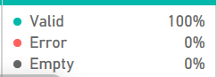

# Business-Sales-Performance-Analytics

## 🎯Business Objective:
Analyze sales data to identify revenue trends, profitable products/categories, regional performance, and growth opportunities.

## 📂 About Dataset

### 🧠 Context
With increasing competition and evolving customer demands, a leading **Superstore retail company** aims to better understand its business performance.  
The objective is to analyze **products, regions, categories, and customer segments** to identify what drives profitability and what areas require improvement.

This analysis helps answer key business questions such as:
- Which products and categories generate the highest revenue and profit?
- Which regions and customer segments perform best?
- Where should the business focus to maximize growth and reduce losses?

The dataset also allows for advanced analysis, including building **regression models** to predict **Sales or Profit**, enabling data-driven forecasting and strategic planning.

---

### 📑 Metadata (Column Descriptions)

- **Row ID**: Unique identifier for each row in the dataset.
- **Order ID**: Unique order identifier assigned to each customer order.
- **Order Date**: Date when the order was placed.
- **Ship Date**: Date when the order was shipped.
- **Ship Mode**: Shipping method selected by the customer.
- **Customer ID**: Unique identifier assigned to each customer.
- **Customer Name**: Name of the customer.
- **Segment**: Customer segment (e.g., Consumer, Corporate, Home Office).
- **Country**: Country where the customer resides.
- **City**: City of residence of the customer.
- **State**: State of residence of the customer.
- **Postal Code**: Postal code of the customer’s location.
- **Region**: Region where the customer belongs (e.g., West, East, Central, South).
- **Product ID**: Unique identifier for each product.
- **Category**: High-level category of the product.
- **Sub-Category**: Sub-category of the product.
- **Product Name**: Name/description of the product.
- **Sales**: Revenue generated from the product.
- **Quantity**: Number of units sold.
- **Discount**: Discount applied to the product.
- **Profit**: Profit or loss incurred from the sale.

## 🧹 Data Quality Check (Null & Error Detection)

To ensure data accuracy and reliability, a **data quality check** was performed using **Power BI Power Query**.

The **Column Quality** feature was enabled to visually inspect the dataset and identify potential data issues.

### 🔍 Column Quality Indicators
- 🟢 **Valid (Green)**: Correct and usable values
- 🔴 **Error (Red)**: Invalid or corrupted values
- ⚪ **Null (Gray)**: Missing values

This step helped in:
- Identifying columns with missing or erroneous data
- Deciding whether to remove, replace, or retain null values
- Ensuring clean input for accurate analysis and dashboard creation

### 📸 Column Quality Preview

📌 *Handling missing and erroneous values at this stage ensures reliable insights and prevents incorrect trend or KPI calculations later in the analysis.*

